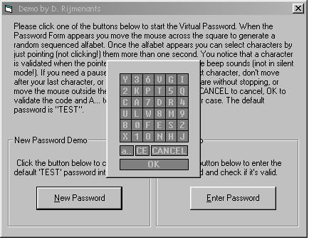



## \[ Virtual Password \]

### Description

This is a whole new concept for entering passwords. By using this system, it's impossible to steal your passwords by keylogging, capturing mouse events or positions, screencaptures or hooking those really unsafe textboxes with hidden but unsafe passwordchars (*). All these tricks cannot be used, and you can enter your password without fear of a compromise. The characters are 'entered' by detecting pauses in moving over a random character field. You'll need to try it, to understand it. The zip includes the Password Form and a Demo Form to explain te function. You're a bit paranoia about security? This is your code! Read all the comments in the code!

PS: Since I noticed that some people didn't understand quit the purpose when I used a textbox in the demo to visualize the result, so I decided to use another way to demonstrate it. Basically it goes like this: Don't use any more that window that pops up and asks you to enter a password in a textbox on the form (even those 

----

-boxes can be read by calling the window from outside your program!), NO, you use the frmEnter INSTEAD of a textbox. The program is NOT used to put a password in a textbox, but to pass the password directly to your sourcecode. All your comments and suggestions are most welcom :-) *** 10/19 made the square change after each char and use random validation times ***
 
### More Info
 

             |
---                |---
**Submitted On**   |2004-10-14 18:34:18
**By**             |[D\. Rijmenants](https://github.com/Planet-Source-Code/PSCIndex/blob/master/ByAuthor/d-rijmenants.md)
**Level**          |Beginner
**User Rating**    |4.6 (128 globes from 28 users)
**Compatibility**  |VB 5\.0, VB 6\.0
**Category**       |[Encryption](https://github.com/Planet-Source-Code/PSCIndex/blob/master/ByCategory/encryption__1-48.md)
**World**          |[Visual Basic](https://github.com/Planet-Source-Code/PSCIndex/blob/master/ByWorld/visual-basic.md)
**Archive File**   |[\[\_Virtual\_18077410192004\.zip](https://github.com/Planet-Source-Code/d-rijmenants-virtual-password__1-56714/archive/master.zip)

